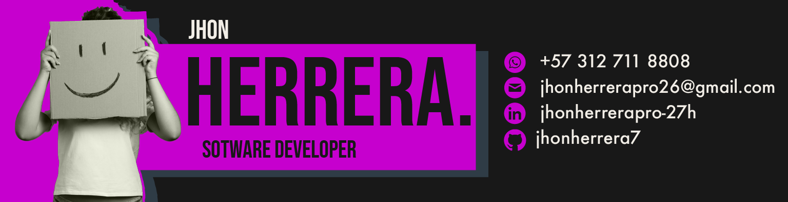

<ul align = "center">
<h1>Hi there,  I'm Jhon  👋</h1>
</ul>

<!--horizontal divider(gradiant)-->

 <!--h1 without bottom border-->

  <ul align="center">
    
<h2 style="display: inline-block">Technologies That I Know👨🏻‍💻</h2>

  </ul>

<!--tech stack icons-->

  

<!-- horizontal divider(gradiant) -->

<!--Mis estadísticas-->
<ul align = "center">
<h2>My GitHub Stats 📊</h2>
</ul>

  

  

&nbsp;

  

<!-- horizontal divider(gradiant) -->

<!-- Connect with me -->
<!--h2 without bottom border-->

  <ul align="center">
    
<h2 style="display: inline-block">Connect With Me🤝</h2>

  </ul>

<!--icons and links-->
<!--Linkedin-->

<!--Discord-->

  

<!--profile visit count-->

  

  

<!--
**jhonherrera7/jhonherrera7** is a ✨ _special_ ✨ repository because its `README.md` (this file) appears on your GitHub profile.

Here are some ideas to get you started:

- 🔭 I’m currently working on ...
- 🌱 I’m currently learning ...
- 👯 I’m looking to collaborate on ...
- 🤔 I’m looking for help with ...
- 💬 Ask me about ...
- 📫 How to reach me: ...
- 😄 Pronouns: ...
- ⚡ Fun fact: ...
-->
